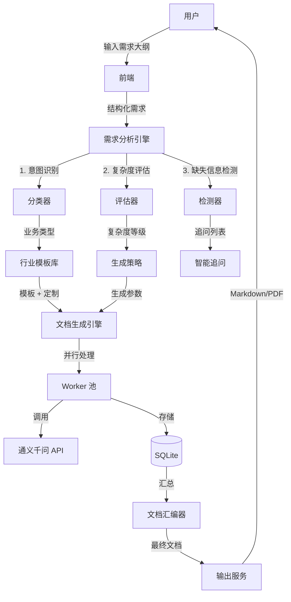

# Agent Skills Server - ERP 需求文档智能生成器

> 让需求文档生成像聊天一样简单！

[](LICENSE)
[](https://python.org)
[](https://docker.com)

---

## 🎯 产品理念

**用户输入最小化，系统输出最大化**

让用户只说"想要什么"，系统自动补充"怎么做"。

---

## ✨ 核心特性

### 1. 极简输入

用户只需输入自然语言需求，例如：
```
我想做一个跨境电商 ERP，主要卖亚马逊和 TikTok，
需要管理商品、订单、物流，最好能自动采购和智能定价。
```

### 2. 智能分析

系统自动识别并补充：
- ✅ 业务模式（B2C/B2B/混合）
- ✅ 目标市场（北美/欧洲/东南亚等）
- ✅ 对接平台（Amazon/TikTok/eBay 等）
- ✅ 核心模块（商品/订单/物流/财务等）
- ✅ 功能点拆解（15-20 个详细功能点）
- ✅ 行业最佳实践（多币种、关税、合规等）

### 3. 智能追问

检测到缺失信息时主动追问：
```
❓ 您的仓库分布在哪些地区？
❓ 自动采购的触发规则是？
❓ 您的本位币是？
```

### 4. 5W2H + 测试驱动文档

每个功能点包含完整要素：
- **Why** - 业务背景（目标、价值、角色、频率、优先级）
- **What** - 功能说明（概述、前置条件、后置结果、业务规则）
- **Input** - 输入设计（用户输入表格、系统输入）
- **Output** - 输出设计（用户可见输出、系统输出）
- **How** - 功能流程（用户操作流程、系统处理流程、状态流转）
- **Interface** - 接口设计（内部 API、外部 API、数据模型）
- **Test** - 测试覆盖（功能用例、边界测试、异常场景、性能要求）
- **Security** - 安全设计（权限、脱敏、审计）
- **Notes** - 特殊说明（跨境特性、技术难点）

---

## 🚀 快速开始

### 方式一：本地运行

```bash
# 1. 克隆项目
git clone https://github.com/zhousiyu-pc/agents.git
cd agents

# 2. 安装依赖
pip install -r requirements.txt

# 3. 设置 API Key
export LLM_API_KEY="sk-你的 APIKey"

# 4. 启动服务
./start.sh

# 5. 访问服务
# API: http://localhost:8766
# 健康检查：http://localhost:8766/api/health
```

### 方式二：Docker 运行

```bash
# 1. 设置 API Key
export LLM_API_KEY="sk-你的 APIKey"

# 2. 启动容器
docker-compose up -d

# 3. 查看日志
docker-compose logs -f
```

---

## 📡 API 使用

### 智能分析并生成需求文档（推荐）

```bash
curl -X POST http://localhost:8766/api/tasks/analyze \
  -H "Content-Type: application/json" \
  -d '{
    "requirement": "我想做一个跨境电商 ERP，主要卖亚马逊和 TikTok，需要管理商品、订单、物流",
    "save_directory": "~/Documents/ERP 需求文档"
  }'
```

**响应示例：**
```json
{
  "success": true,
  "task_id": "a1b2c3d4e5f6",
  "feature_count": 18,
  "complexity": "中等",
  "core_modules": ["商品", "订单", "物流", "采购"],
  "platforms": ["Amazon", "TikTok Shop"],
  "questions": [
    {
      "field": "warehouse_locations",
      "question": "您的仓库分布在哪些地区？",
      "options": ["仅国内仓", "国内 + 海外仓", "纯海外仓"]
    }
  ],
  "message": "已创建任务，将生成 18 个功能点的详细需求文档"
}
```

### 查询任务进度

```bash
curl http://localhost:8766/api/tasks/a1b2c3d4e5f6
```

### 获取任务结果

```bash
curl http://localhost:8766/api/tasks/a1b2c3d4e5f6/results
```

---

## 📊 系统架构



---

## 📁 项目结构

```
agents/
├── core/                       # 核心基础设施
│   ├── config.py               # 全局配置（支持环境变量）
│   ├── db.py                   # SQLite 数据库管理
│   ├── llm_client.py           # 通义千问 API 客户端
│   ├── logger.py               # 日志管理
│   └── analyzer.py             # 🆕 需求分析引擎
├── skills/                     # Skill 模块
│   ├── file_saver/             # 文件保存
│   │   ├── service.py
│   │   ├── routes.py
│   │   └── mcp_tools.py
│   └── task_manager/           # 🆕 任务管理（集成智能分析）
│       ├── service.py
│       └── routes.py
├── dify_apps/                  # Dify 应用配置
├── Dockerfile                  # 🆕 Docker 镜像
├── docker-compose.yml          # 🆕 Docker Compose
├── requirements.txt            # 🆕 Python 依赖
├── .gitignore                  # 🆕 Git 忽略
├── DESIGN.md                   # 🆕 产品设计方案
├── start.sh                    # 启动脚本
├── stop.sh                     # 停止脚本
└── main.py                     # 统一入口
```

---

## 🔧 配置说明

### 环境变量

| 变量 | 默认值 | 说明 |
|------|--------|------|
| `LLM_API_KEY` | (必填) | 通义千问 API Key |
| `LLM_MODEL` | qwen-plus | 模型名称 |
| `SKILLS_PORT` | 8766 | 服务端口 |
| `TASK_WORKERS` | 3 | 并发 Worker 数量 |
| `SKILLS_DATA_DIR` | ~/.agent_skills | 数据存储目录 |
| `DEFAULT_SAVE_DIR` | ~/Documents/ERP 需求文档 | 默认保存目录 |
| `DEBUG` | false | 调试模式 |

### 配置方式

```bash
# 方式 1：环境变量
export LLM_API_KEY="sk-xxx"
export TASK_WORKERS=5

# 方式 2：.env 文件
cp .env.example .env
# 编辑 .env 文件

# 方式 3：启动参数
./start.sh --llm-key "sk-xxx" --workers 5
```

---

## 📝 输出文档示例

最终生成的需求文档包含：

```markdown
# B2C 零售跨境电商 ERP 系统 - 需求规格说明书

> 文档版本：1.0  
> 生成时间：2026-03-11 11:00  
> 复杂度：中等 | 预估功能点：18

## 一、项目概述
### 1.1 业务背景
面向全球市场的 B2C 零售跨境电商 ERP...

### 1.2 跨境电商特有考虑
- 多币种支持（USD/EUR/GBP/JPY 等）
- 多语言支持（英文/德文/法文/日文等）
- 时区自动转换
- 关税/VAT 计算

## 二、系统架构
...

## 四、功能点详细设计
### 商品录入
#### 1. Why - 业务背景
- 业务目标：...
- 用户价值：...
...

### 订单拉取
...
```

---

## 🧪 测试

```bash
# 运行测试
pytest tests/ -v --cov=agent_skills_server

# 运行单个测试
pytest tests/test_analyzer.py -v
```

---

## 🛠️ 开发

```bash
# 安装开发依赖
pip install -r requirements.txt

# 代码格式化
black agent_skills_server/
isort agent_skills_server/

# 类型检查
mypy agent_skills_server/

# 代码检查
flake8 agent_skills_server/
```

---

## 📋 API 端点总览

| 端点 | 方法 | 功能 |
|------|------|------|
| `/api/health` | GET | 健康检查 |
| `/api/tasks/analyze` | POST | 🆕 智能分析并创建任务 |
| `/api/tasks` | POST | 创建任务 |
| `/api/tasks/{id}` | GET | 查询任务进度 |
| `/api/tasks/{id}/results` | GET | 获取任务结果 |
| `/api/tasks/{id}/retry` | POST | 重试失败任务 |
| `/api/files/save` | POST | 保存文件 |
| `/api/files/directories` | GET | 列出可用目录 |

---

## 🎨 前端集成示例

```javascript
// 提交需求
async function submitRequirement(requirement) {
  const response = await fetch('http://localhost:8766/api/tasks/analyze', {
    method: 'POST',
    headers: { 'Content-Type': 'application/json' },
    body: JSON.stringify({
      requirement: requirement,
      save_directory: '~/Documents/ERP 需求文档'
    })
  });
  return await response.json();
}

// 轮询进度
async function pollTaskProgress(taskId) {
  while (true) {
    const response = await fetch(`http://localhost:8766/api/tasks/${taskId}`);
    const task = await response.json();
    
    if (task.status === 'completed' || task.status === 'partial') {
      // 获取结果
      const resultResponse = await fetch(`http://localhost:8766/api/tasks/${taskId}/results`);
      return await resultResponse.json();
    }
    
    // 更新进度条
    updateProgressBar(task.completed_count, task.total_count);
    
    // 等待 5 秒后重试
    await new Promise(resolve => setTimeout(resolve, 5000));
  }
}
```

---

## 🚧 后续计划

- [ ] 前端交互界面
- [ ] PDF/Word 导出
- [ ] Jira/禅道集成
- [ ] 版本管理
- [ ] 实时预览
- [ ] 多语言支持

---

## 📄 License

MIT License

---

_让需求文档生成像聊天一样简单！_
