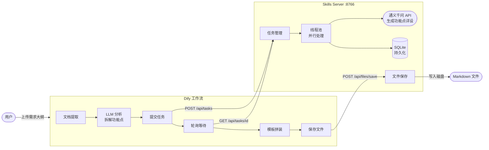

# Agent Skills Server

为外部 Agent（如 Dify 工作流）提供 Skill 能力的统一后台服务。

---

## 系统实现流程简图



> **核心思路**：Dify 工作流负责编排，Skills Server 负责重活（并行生成 + 持久化 + 文件保存）。
> Skills Server 直接调用通义千问 API 生成功能点详设，不再依赖 Dify 中间层。
> 功能点拆成独立子任务并行跑，结果存 SQLite，中断重启后自动恢复，不重复已完成的。

---

## 项目结构

```
agent_skills_server/
├── main.py                     # 统一启动入口
├── start.sh                    # 启动脚本
├── stop.sh                     # 停止脚本
├── core/                       # 核心基础设施
│   ├── config.py               # 全局配置（环境变量管理）
│   ├── db.py                   # SQLite 数据库管理
│   ├── llm_client.py           # 通义千问 API 客户端（内置 prompt）
│   └── logger.py               # 日志管理（全局 + 按任务隔离）
├── skills/                     # Skill 模块（按功能划分）
│   ├── file_saver/             # 文件保存 Skill
│   │   ├── service.py          # 核心保存逻辑
│   │   ├── routes.py           # REST API 路由
│   │   └── mcp_tools.py        # MCP Tool 注册
│   └── task_manager/           # 任务管理 Skill
│       ├── service.py          # 任务提交/执行/恢复逻辑
│       └── routes.py           # REST API 路由
└── dify_apps/                  # Dify 应用 YAML（需导入 Dify）
    └── 跨境电商ERP需求文档生成器.yml  # Workflow 应用（用户直接使用）
```

## 快速开始

```bash
# 设置通义千问 API Key（从阿里云百炼平台获取）
export TONGYI_API_KEY="sk-你的APIKey"

# 启动
./start.sh

# 停止
./stop.sh

# 带参数启动
./start.sh --tongyi-key "sk-xxxxx" --workers 5
```

## 环境变量

| 变量 | 默认值 | 说明 |
|------|--------|------|
| `SKILLS_PORT` | 8766 | 服务端口 |
| `TONGYI_API_KEY` | (空) | 通义千问 API Key（必填） |
| `TONGYI_MODEL` | qwen-plus | 通义千问模型名称 |
| `TASK_WORKERS` | 3 | 并发 Worker 数量 |
| `SKILLS_DATA_DIR` | ~/.agent_skills | 数据/日志存储目录 |
| `DEFAULT_SAVE_DIR` | ~/Documents/ERP需求文档 | 默认文件保存目录 |

## API 端点

| 端点 | 方法 | Skill | 功能 |
|------|------|-------|------|
| `/api/health` | GET | - | 健康检查 |
| `/api/files/save` | POST | 文件保存 | 保存 Markdown 文件 |
| `/api/files/directories` | GET | 文件保存 | 列出可用保存目录 |
| `/api/tasks` | POST | 任务管理 | 提交功能点生成任务 |
| `/api/tasks/{id}` | GET | 任务管理 | 查询任务进度 |
| `/api/tasks/{id}/results` | GET | 任务管理 | 获取任务结果 |
